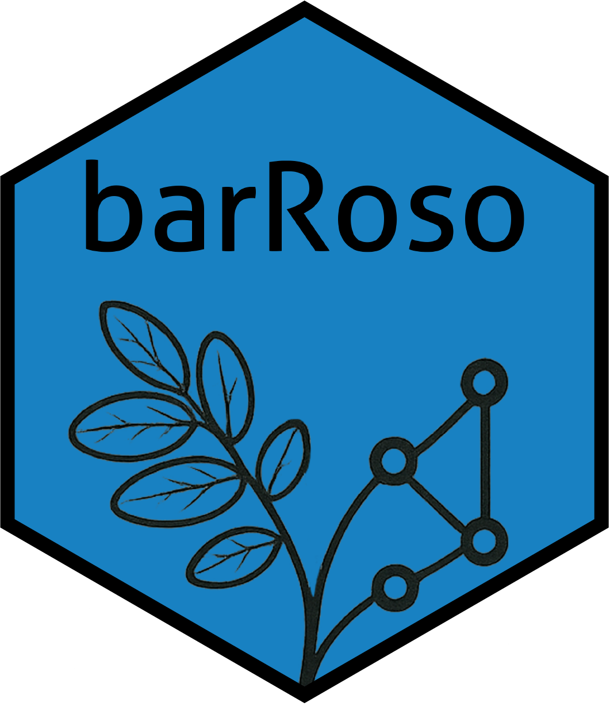

<!-- README.md is generated from README.Rmd. Please edit that file -->

```{r, include = FALSE}
knitr::opts_chunk$set(
  collapse = TRUE,
  comment = "#>",
  fig.path = "figures/",
  out.width = "100%"
)
```

# barroso 

<!-- badges: start -->
[](https://app.codecov.io/gh/DBOSlab/barroso)
[](https://github.com/DBOSlab/barroso/actions/workflows/test-coverage.yaml)
[](https://cran.r-project.org/package=barroso)
[](https://github.com/DBOSlab/barroso/actions/workflows/R-CMD-check.yaml)
[](LICENSE)
<!-- badges: end -->


Biodiversity Analysis and Record Reconciliation for Organizing Specimen Observations.\
\
\

## Overview

`barroso` is an R package designed to clean, standardize, and reconcile biodiversity collection records—especially those from herbaria and virtual databases. Named in honor of Brazilian botanist [Graziela Maciel Barroso](https://www.gov.br/jbrj/pt-br/assuntos/colecoes/arquivistica/graziela-maciel-barroso), this toolkit provides flexible functions to harmonize specimen data across diverse sources. The name BARROSO also stands for: Biodiversity Analysis & Record Reconciliation for Organizing Specimen Observations. This acronym also subtly highlights its close connection to the R programming language, as a symbolic nod to the R ecosystem in which the package is developed. 

The package automates the cleaning and standardization of herbarium records from public biodiversity databases such as [GBIF](https://www.gbif.org), [SEINet](https://swbiodiversity.org/seinet/), [REFLORA Virtual Herbarium](https://floradobrasil.jbrj.gov.br/reflora/herbarioVirtual/), Rio de Janeiro Botanical Gardens's [JABOT](https://jabot.jbrj.gov.br/v3/consulta.php) herbarium collections, and [speciesLink](https://specieslink.net). It is particularly useful for standardizing collector names and collection numbers across herbarium datasets, helping resolve long-standing issues in biodiversity informatics, such as identifying duplicate specimens distributed among different herbaria.

In addition, `barroso` supports the generation of herbarium labels from field notebooks or observation data.

Unlike many packages that rely on static dictionaries to clean collector names, `barroso` uses a robust set of regular expressions (regex) to dynamically identify and standardize collector patterns across datasets. This approach allows `barroso` to generalize better across sources and spelling variations — even when names are inconsistently formatted. Combined with harmonization of geographic and taxonomic fields, this makes the package especially powerful for detecting duplicates and preparing data for downstream analysis.

While many data tools prioritize aggressive cleaning, often at the cost of discarding valuable records, `barroso` takes a different approach. Its philosophy centers on standardization rather than removal. All herbarium specimens carry potential scientific value, even when incomplete or inconsistently entered. Instead of omitting such records, barroso focuses on harmonizing fields to enhance comparability across collections. By standardizing collector names, geographic fields, and taxonomic labels, barroso allows users to flag rather than erase inconsistencies—enabling more transparent workflows and empowering users to trace potential misidentifications, especially across distributed duplicates. This inclusive approach honors the archival role of herbaria while facilitating reproducible biodiversity research.\
\
\

## Key Features

✅ Harmonize collector names and collection numbers

✅ Detect and reconcile duplicate specimens across datasets

✅ Clean geographic, taxonomic, and temporal fields

✅ Generate standardized herbarium labels from field records

✅ Integrate with public blant taxonomic portals such as World Flora Online and Flora, LCVP, and Funga of Brasil


## Installation

You can install the development version of `barroso` from [GitHub](https://github.com/) directly from R using the `install_github` function of devtools (you may need to 
install that one first). To fully use `barroso` you also need to install the
[lcvplants](https://idiv-biodiversity.github.io/lcvplants/) and [LCVP](https://github.com/idiv-biodiversity/LCVP) packages first.

``` r
# install.packages("devtools")

devtools::install_github("idiv-biodiversity/LCVP")
devtools::install_github("idiv-biodiversity/lcvplants")

devtools::install_github("DBOSlab/barroso")
```

```r
library(barroso)
```
\
\

## Usage

Below are the key functions provided by the barroso package for working with biodiversity and herbarium specimen data:.\
\
\

#### _1. `barroso_std()`:  Standardize Herbarium Records_

This function serves as the core standardization pipeline for cleaning herbarium specimen records. It accepts raw data frames from any herbarium source and applies a series of cleaning and harmonization steps, including:

Standardizing collector names and collection numbers
Cleaning and unifying geographic fields (country, state, locality, etc.)
Harmonizing taxonomic names using authority sources
Normalizing type status entries
Optionally detecting and removing duplicates
It accepts flexible column naming via arguments and can handle large datasets in chunks to avoid memory issues.\
\

##### Example of using `barroso_std`:
``` r
library(barroso)

df <- read.csv("raw_herbarium_data.csv")
cleaned_df <- barroso_std(df,
                          unvouchered = TRUE,
                          delunkcoll = FALSE,
                          flag_missid = TRUE,
                          flag_duplicates = TRUE,
                          rm_duplicates = TRUE,
                          colname_recordedBy = "recordedBy",
                          colname_recordNumber = "recordNumber",
                          colname_continent = "continent", 
                          colname_country = "country",
                          colname_stateProvince = "stateProvince",
                          colname_county = "county",
                          colname_municipality = "municipality",
                          colname_locality = "locality",
                          colname_collectionCode = "collectionCode",
                          colname_institutionCode = "institutionCode",
                          colname_typeStatus = "typeStatus",
                          colname_family = "family",
                          colname_genus = "genus",
                          colname_specificEpithet = "specificEpithet", 
                          rm_original_column = TRUE)
```
\
\
\

#### _2. `barroso_flag_duplicates()`: Detect Duplicate Specimens_

This function flags potential duplicate specimens in a dataset by comparing key fields such as recordedBy, recordNumber, species, and collection date (year, month, day). It assigns a duplicate = TRUE/FALSE flag to each row.

You can use this function standalone to identify duplicates or integrate it via barroso_std()\
\

##### Example of using `barroso_flag_duplicates`:
``` r
library(barroso)

flagged_df <- barroso_flag_duplicates(df,
                                      rm_duplicates = FALSE)
```
\
\
\

#### _3. `barroso_labels()`: Generate Herbarium Labels from Field Data_

This function makes herbarium labels from field book in spreadsheet CSV format. 
It is currently more comprehensive for making herbarium labels from specimens 
collected in the USA, because it will display geographic maps also at county level. 
For specimens collected in all other countries, the label will display only the 
country level map. If geographic coordinates are provided, then the specimen record 
is also plotted in the map. The function also insert taxon authorities and nomenclatural
updates automatically, by implementing an internal function from [lcvplants](https://idiv-biodiversity.github.io/lcvplants/).\
\

##### Example of using `barroso_labels`:
``` r
library(barroso)

df <- read.csv("Data/MSU_duplicates_to_HUEFS.csv", sep = ",")

barroso_labels(fieldbook = df,
               dir_create = "results_herbarium_labels",
               file_label = "herbarium_labels.pdf")
```
\
\
\

## Documentation

A detailed description of the `barroso`'s full functionality is available in 
different [articles](https://dboslab.github.io/barroso/).\
\
\

## Acknowledgments

This package is named in honor of Graziela Maciel Barroso (1912–2003), a pioneer of Brazilian botany. Her contributions to plant taxonomy and herbarium science inspire this tool.
\
\

## Citation

Cardoso, D. (2025). _barroso_: Biodiversity Analysis and Record Reconciliation for Organizing Specimen Observations. https://github.com/dboslab/barroso
